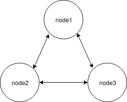

# c-lightning Docker Setup

The docker-compose images and the instructions in this repository are to setup a local Bitcoin network (regtest mode) and run a Lightning Network (c-lightning nodes) over it.

## Setup

There is one docker-compose file for each node in our Lightning Network. Each docker-compose file has two services each, one that runs `bitcoind` and another that runs `lightningd`. We will need an instance of both for each node. We can connect all the c-lightning daemons to the same `bitcoind` instance, but for the sake of completeness we will set up an instance of `bitcoind` for each node.

The bitcoind containers will be named `bitcoind1`, `bitcoind2` and so on, and the corresponding lightningd containers `lightningd1`, `lightningd2` and so on. We will be opening multiple terminal windows to interact with the daemons via CLI. A single terminal can also be used but I find it convenient to have terminals open to each container. I believe using a terminal multiplexer to handle multiple terminals is possible, but I am not an expert at it and is left to you to try :)

We will be setting up a topology as follows:


You can create more nodes by duplicating the docker-compose files and set up a topology of your choice.

All the containers are connected via a `clightning_network` docker network.

Note that there may be a better way to do this, but I am new to docker and this was one way I found to go about this. If there is a more optimal way, feel free to raise a pull request.

## Running the containers
Clone the repository onto your PC:
```bash
git clone https://github.com/samvid25/c-lightning-docker.git
```

Create the `lightningd` and `bitcoind` containers. Run this for all the docker-compose files in different terminal windows/tabs.
```bash
docker-compose -f "docker-compose-1.yml" up
```
Now, our 4 lightning nodes are set-up. Open 2 terminals each for every node, one to interact with `bitcoind` and one for `lightningd`. Repeat the following for every node in different terminals:

```bash
docker exec -i -t bitcoind1 bash
```
```bash
docker exec -i -t lightnind1 bash
```
We will be using `bitcoin-cli` to interact with `bitcoind` and `lightning-cli` to interact with `lightningd`. Aliases can be used to make your life easier:
```bash
bitcoind1$ cat >> /home/.bashrc
alias bc='bitcoin-cli'

bitcoind1$ source /home/.bashrc
```
```bash
lightningd1$ cat >> /home/.bashrc
alias lc='lightning-cli'

lightningd1$ source /home/.bashrc
```
Repeat the same for all containers.

But using bitcoin-cli runs into a `rpcuser` error where it says credentials are not found. We will have to manually edit the `bitcoin.conf` file present at `/root/.bitcoin/`:
```bash
bitcoind1$ cat > /root/.bitcoin/bitcoin.conf
printtoconsole=1
rpcallowip=::/0
regtest=1
whitelist=0.0.0.0/0
server=1
rpcuser=rpcuser
rpcpassword=rpcpass
```
To ensure that all the nodes have a copy of the same blockchain, establish connections within themselves by appending a `addnode=bitcoind1` to the config file for the subsequent `bitcoind` instances. (`addnode=bitcoind2` can also be added to `bitcoind3` and so on)

I believe this can also be done via the docker-compose file without having to manually doing it after container deployment. Will update the docker-compose files with the same soon.

The following sections assume you run the commands in their appropriate terminals (bitcoin-cli in the bitcoind terminals and the lightning-cli in the lightningd terminals) for the required nodes.

Generate a few blocks on one of the nodes and see if the other nodes detect the blocks. If so, then the containers have been set up correctly.
```bash
bitcoind1$ bc generate 5
```

## Creating connections

Obtain the ID of all the lightning nodes using:
```bash
lightningd1$ lc getinfo | grep id

lightningd2$ lc getinfo | grep id

lightningd3$ lc getinfo | grep id
```

Then connect the nodes to each other:
```bash
lightningd1$ lc connect <id2>@lightningd2
lightningd1$ lc connect <id3>@lightningd3

lightningd2$ lc connect <id3>@lightningd3
```

Now, we need a payment address to fund the node. Run the following on all the nodes and note the generated address for each node:
```bash
lightningd1$ lc newaddr

lightningd2$ lc newaddr

lightningd3$ lc newaddr
```

Now, we need to fund these nodes. Generate a few blocks so that some bitcoin is created. And then send funds (as required) to the addresses:
```bash
bitcoind1$ bc generate 200
bitcoind1$ bc sendtoaddress <address1> 200
bitcoind1$ bc sendtoaddress <address2> 200
bitcoind1$ bc sendtoaddress <address3> 200
bitcoind1$ bc generate 10
```
A few blocks are generated at the end to confirm the above transactions.

Use the following command to check if funds have been received or not.
```bash
lightningd1$ lc listfunds

lightningd2$ lc listfunds

lightningd3$ lc listfunds
```

## Opening channels

Once the nodes have enough funds to open a channel, channels can be opened with:
```bash
lightningd1$ lc fundchannel <id2> 150000

lightningd2$ lc fundchannel <id3> 150000

lightningd3$ lc fundchannel <id1> 150000
```
But the the funding transaction for this channel is still unconfirmed. Hence, a few blocks have to be generated to confirm the funding transaction and change the `state` of the channel to `CHANNELD_NORMAL` and make its visibility public.
```bash
bitcoind1$ bc generate 10
```

All the known (active) channels in the network can be listed using:
```bash
lightningd1$ lc listchannels
```
In a larger network, the existance of a path to a node identified by <id> can be checked using:
```bash
lc getroute <id> <msatoshi> <riskfactor>
```

## Optional: Changing lightningd configuration

Modify (or Add if it doesn't exist) the config file present at `/root/.lightning/` with the required parameters and restart lightningd:
```bash
lightningd1$ lc stop
```
```bash
docker start lightningd1
docker exec -i -t lightningd1 bash
```

_in progress_
